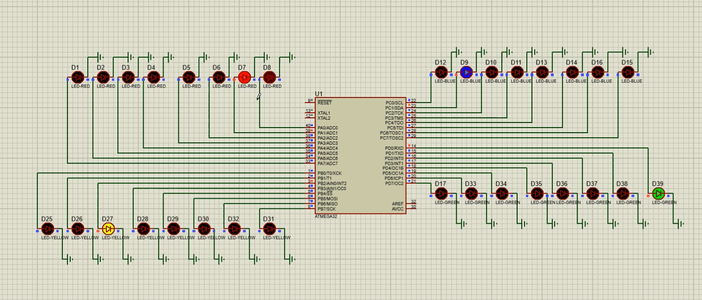

# Parallel LED Controller 🚀


A high-efficiency, bare-metal embedded system designed for parallel LED controlling and advanced sequence automation. This repository contains the complete firmware implementations, assembly listings, production binaries, and hardware simulation files for ATmega32 microcontrollers.

---

## 📌 Project Overview

This project implements a precise parallel switching architecture for LED arrays across four independent output ports (PORTA, PORTB, PORTC, PORTD). By utilizing direct register manipulation, optimized low-level routines, and power-saving Idle sleep modes, it guarantees deterministic timing control and low power consumption.

The repository features two distinct architectural approaches for handling independent, non-blocking timing thresholds:

1. **Version 1 (Fixed-Tick Architecture):** Implements a fixed `10ms` base scheduler tick using Timer1 and evaluates conditions periodically.
2. **Version 2 (Event-Driven Variable Tick Architecture):** Dynamically calculates the closest upcoming event, schedules a precise variable sleep duration using a parameterized delay function `sleep_timer1_ms(x)`, and adjusts remaining times symmetrically to eliminate redundant CPU wake-ups.

---

## 💻 Hardware Simulation

The circuit design and verification have been fully simulated in Proteus. The operational layout displays synchronous shifting patterns across the LED arrays under precise timing intervals.

<p align="center">
  
</p>

---

## 🗂️ Repository Structure

The project layout is structured according to professional embedded development standards:

| File / Folder Path | Type | Description |
| :--- | :--- | :--- |
| `parallel-led-v1.c` | **Source Code** | Firmware utilizing the fixed 10ms base scheduler tick loop. |
| `parallel-led-v2.c` | **Source Code** | Advanced event-driven firmware utilizing dynamic variable-tick scheduling. |
| `parallel-led-v2.atsln` | **Solution File** | Microchip / Atmel Studio project workspace. |
| `simulation.png` | **Image** | Visual schematic capture and logic verification from Proteus simulation. |
| `Debug/Exe/parallel-led-v2.hex` | **Binary Intel HEX** | Production-ready machine code ready to target flash memory. |
| `Debug/Exe/parallel-led-v2.rom` | **Binary ROM Image** | Raw EEPROM/ROM non-volatile image data. |
| `Debug/List/parallel-led-v2.asm`| **Assembly Source** | Compiler-generated assembly code for critical timing inspection. |
| `Debug/List/parallel-led-v2.lst`| **Listing File** | Interleaved source-to-assembly guide for hardware step-by-step debugging. |
| `Debug/List/parallel-led-v2.map`| **Memory Map** | Linker mapping showing exact SRAM/Flash utilization per symbol. |

---

## 🛠️ Technical Specifications

### Core Mechanisms

* **Direct Register Level IO:** Pin configurations and output mutations manipulate raw GPIO registers (`DDRA-D`, `PORTA-D`) natively for single-clock-cycle execution.
* **Low-Power Idle Management:** Both firmware architectures leverage the ATmega32 `MCUCR` sleep bits. The CPU enters an **Idle Sleep Mode** during delay periods, keeping Timer1 operational while lowering power consumption until an interrupt triggers a wake-up.
* **Bit-Shifting Overflows:** Circular byte-rotation `(val << 1) | (val >> 7)` yields smooth, continuous 8-bit LED chasing animations without branching overhead.

### Architectural Comparison

#### 1. Fixed-Tick Loop (`parallel-led-v1.c`)
Loops continuously with a strict baseline sleep interval of exactly `10ms`. It increments tracking accumulators (`timeA` to `timeD`) and triggers an update whenever they hit or exceed their respective defined boundaries (`THRESHOLD_A` to `THRESHOLD_D`).

#### 2. Event-Driven Dynamic Scheduling (`parallel-led-v2.c`)
Continuously evaluates the relative mathematical order between remaining threshold counts. It triggers the minimum required time slice natively via `sleep_timer1_ms(x)`, where `OCR1A = 999 * x`. Symmetrically decrements all active accumulators relative to the elapsed period, maximizing deep sleep efficacy.

---

## 🔧 Building and Flashing

### Prerequisites

* **IDE:** Microchip Studio (formerly Atmel Studio) or any standard GNU AVR Toolchain.
* **Compiler:** CodeVisionAVR / `avr-gcc` configured for an 8MHz clock rate.

### Deployment Instruction

To flash the compiled Intel Hex binary directly to your target microcontroller, execute the following command in your terminal:

```bash
avrdude -c <your_programmer> -p m32 -U flash:w:Debug/Exe/parallel-led-v2.hex:i
